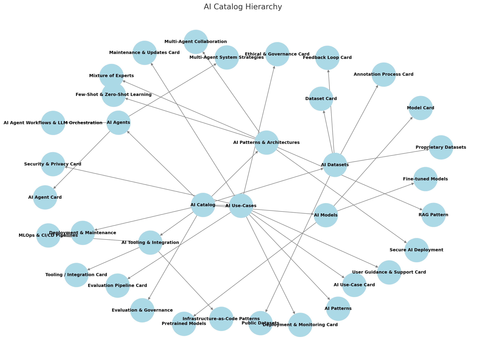

### **AI Catalog Hierarchy & Tree Structure**
To organize your **AI Catalog** with interconnected **AI Use-Case Cards, Model Cards, Dataset Cards, Agent Cards, and other documentation**, we can structure it into a hierarchical tree. The **AI Patterns** will emerge as cross-cutting elements across multiple components.

---
#### **📂 AI Catalog (Root)**
- 📂 **AI Use-Cases**
  - 📄 AI Use-Case Card (per AI application)
  - 📂 AI Patterns (Cross-cutting AI techniques, such as RAG, Few-Shot Learning, etc.)
  - 📂 Evaluation & Governance
    - 📄 Evaluation Pipeline Card
    - 📄 Ethical & Governance Card
    - 📄 Security & Privacy Card
  - 📂 Deployment & Maintenance
    - 📄 Deployment & Monitoring Card
    - 📄 User Guidance & Support Card
    - 📄 Maintenance & Updates Card
- 📂 **AI Models**
  - 📄 Model Card (per AI model)
  - 📂 Pretrained Models
    - 📄 Foundation Model Cards (e.g., GPT-4, LLaMA-3, Claude)
  - 📂 Fine-tuned Models
    - 📄 Task-Specific Model Cards (e.g., VA Clinical NER Model)
- 📂 **AI Agents**
  - 📄 AI Agent Card (per AI agent)
  - 📂 Tool Use & Planning Strategies
    - 📄 AI Agent Workflows & LLM Orchestration
    - 📄 Multi-Agent System Strategies
- 📂 **AI Datasets**
  - 📄 Dataset Card (per dataset)
  - 📂 Public Datasets
    - 📄 Common Benchmark Dataset Cards
  - 📂 Proprietary Datasets
    - 📄 Internal/Private Dataset Cards
  - 📂 Annotation & Feedback
    - 📄 Annotation Process Card
    - 📄 Feedback Loop Card
- 📂 **AI Tooling & Integration**
  - 📄 Tooling / Integration Card (per API/service)
  - 📂 Infrastructure & Compute
    - 📄 MLOps & CI/CD Pipelines
    - 📄 Infrastructure-as-Code (IaC) Patterns
- 📂 **AI Patterns & Architectures**
  - 📄 RAG Pattern
  - 📄 Few-Shot & Zero-Shot Learning
  - 📄 Mixture of Experts
  - 📄 Multi-Agent Collaboration
  - 📄 Secure AI Deployment (FedRAMP, NIST 800-53)

---
### **Key Structural Insights**
1. **AI Use-Case Cards act as the entry point** 🏛️  
   - These link to specific **Model Cards, Dataset Cards, Agent Cards**, and other artifacts.
   
2. **AI Patterns are cross-cutting across components** 🔄  
   - Example: RAG can be an **AI Pattern** that applies to both **Use-Cases (RAG Pipeline), AI Models (Embedding Model), and AI Agents (Retriever-Augmented Agent).**

3. **Evaluation, Deployment, and Governance are modular** 🔒  
   - Each AI Use-Case can reference centralized **Evaluation & Governance** materials to avoid duplication.

4. **Interoperability & Tooling capture integrations** 🛠️  
   - External APIs, fine-tuning strategies, and tool use should be tracked in **Tooling Cards**.

---
### **Next Steps**
1. **Finalize the AI Pattern List** → Define AI techniques that should be standardized across your AI systems.
2. **Standardize Metadata** → Ensure each card (AI Use-Case, Model, Dataset, Agent) has a consistent metadata format.
3. **Graph Representation (Neo4j)** → Represent AI Use-Cases, Models, Datasets, and Agents as a **knowledge graph** for better traceability and governance.
4. **Automation & Versioning** → Establish pipelines for auto-generating and updating cards based on model/data updates.

---

Here's an **AI Catalog Hierarchy Graph** showing the relationships between **AI Use-Cases, Models, Agents, Datasets, Tooling, and AI Patterns**. 

  

